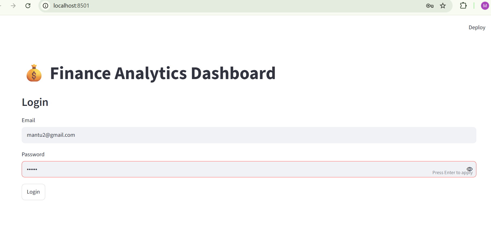
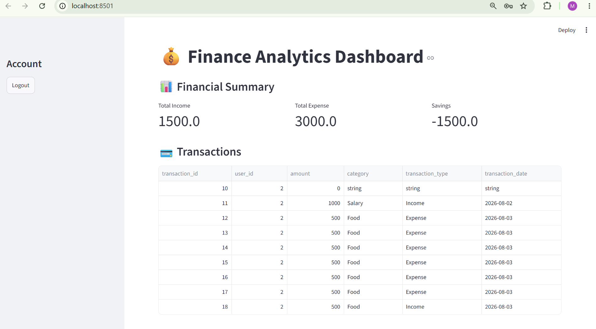
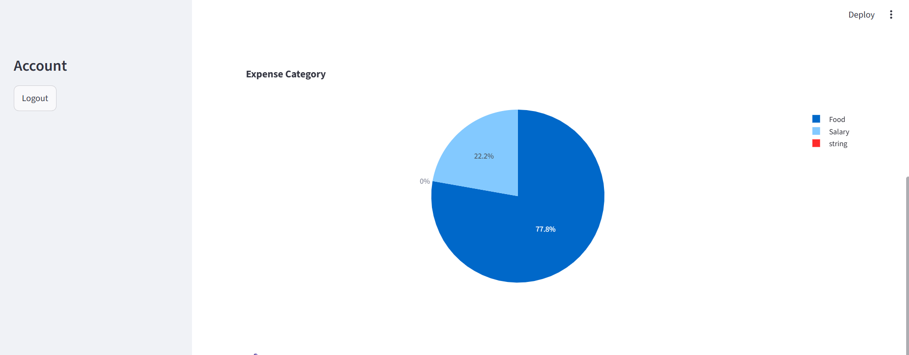
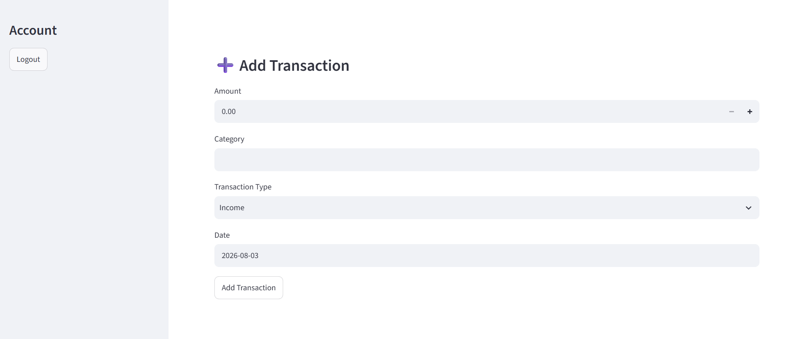

# Finance Analytics System

A Python-based financial management and analytics system that tracks income and expenses, provides REST APIs, performs financial analysis, and generates visualization reports.

The project is built using **FastAPI**, **SQLite**, **Pandas**, **Matplotlib**, and **Streamlit** with JWT based user authentication.

---

# Features

- User registration
- User login
- JWT authentication
- Protected REST APIs
- Add financial transactions
- View user transactions
- Delete transactions
- Calculate total income
- Calculate total expenses
- Calculate savings
- Category-wise expense analysis
- Generate financial charts
- Interactive Streamlit dashboard
- SQLite database integration
- Automated API testing using Pytest

---

# Tech Stack

## Backend

- Python
- FastAPI
- Pydantic
- Uvicorn

## Database

- SQLite

## Authentication

- JWT Authentication
- OAuth2 Password Flow
- Passlib
- Bcrypt

## Data Analysis

- Pandas
- NumPy

## Visualization

- Matplotlib
- Seaborn
- Plotly

## Dashboard

- Streamlit

## Testing

- Pytest
- FastAPI TestClient

---

# Project Structure

```
Finance-Analytics-System

├── app
│ ├── main.py # FastAPI API routes
│ ├── models.py # Request and response models
│ ├── database.py # Database connection
│ ├── crud.py # Database CRUD operations
│ ├── analytics_service.py # User based analytics logic
│ ├── users.py # Register and Login APIs
│ ├── auth.py # JWT token creation
│ ├── security.py # Password hashing
│ ├── dependencies.py # JWT authentication
│ ├── migrate.py # Database migration
│ └── init.py
│
├── dashboard
│ └── app.py # Streamlit dashboard
│
├── database
│ └── finance.db # SQLite database
│
├── screenshots
│ ├── login.png # Login page screenshot
│ ├── dashboard.png # Dashboard screenshot
│ ├── expense.png # Expense analysis screenshot
│ └── add_transaction.png # Add transaction screenshot
│
├── tests
│ └── test_api.py # API test cases
│
├── requirements.txt
└── README.md
```

---

# Database Design

## Users Table

Stores user information.

```
user_id
name
email
password
```

---

## Transactions Table

Stores financial transactions.

```
transaction_id
user_id
amount
category
transaction_type
transaction_date
```

---

# Authentication API

## Register User

### POST

```
/register
```

Request:

```json
{
  "name": "Mantu Kumar",
  "email": "mantu@gmail.com",
  "password": "123456"
}
```

Response:

```json
{
  "message": "User registered successfully"
}
```

---

# Login API

### POST

```
/login
```

Request:

```json
{
  "username": "mantu@gmail.com",
  "password": "123456"
}
```

Response:

```json
{
  "access_token": "your_token",
  "token_type": "bearer"
}
```

Use this token in Swagger Authorize.

---

# API Endpoints

## Home API

### GET

```
/
```

Response:

```json
{
  "message": "Finance Analytics API Running"
}
```

---

# Transactions API

All transaction APIs require JWT authentication.

---

## Get Transactions

### GET

```
/transactions
```

Returns only logged-in user's transactions.

Example:

```json
[
  {
    "transaction_id": 1,
    "user_id": 1,
    "amount": 500,
    "category": "Food",
    "transaction_type": "Expense",
    "transaction_date": "2026-08-01"
  }
]
```

---

## Add Transaction

### POST

```
/transactions
```

Request:

```json
{
  "amount": 300,
  "category": "Shopping",
  "transaction_type": "Expense",
  "transaction_date": "2026-08-03"
}
```

Note:

`user_id` is automatically taken from JWT token.

Response:

```json
{
  "message": "Transaction added successfully"
}
```

---

## Delete Transaction

### DELETE

```
/transactions/{transaction_id}
```

Example:

```
/transactions/1
```

Response:

```json
{
  "message": "Transaction deleted successfully"
}
```

------

# Financial Analytics API

## Get Analytics

### GET

```
/analytics
```

Returns financial summary of logged-in user.

Example Response:

```json
{
  "total_income": 2000,
  "total_expense": 1300,
  "savings": 700
}
```

---

# Streamlit Dashboard

The project includes an interactive financial dashboard built using **Streamlit**.

The dashboard connects with FastAPI backend APIs and provides a user-friendly interface for managing and analyzing financial data.

## Dashboard Features

- JWT based user login
- View total income
- View total expenses
- Calculate savings
- View transactions
- Add new transactions
- Expense category visualization
- Real-time data from FastAPI APIs


## Run Dashboard

Activate virtual environment:

Windows:

```bash
venv\Scripts\activate
```

Install dashboard dependencies:

```bash
pip install streamlit plotly requests
```

Start FastAPI backend:

```bash
uvicorn app.main:app --reload
```

Open another terminal and run:

```bash
streamlit run dashboard/app.py
```

Dashboard URL:

```
http://localhost:8501
```

---

# Analytics and Visualization

The system performs financial analysis and generates visualization reports.

## Category Wise Expense Chart

Shows expenses based on different categories.

Example:

```
Food      500
Travel    800
Shopping  300
```

## Income vs Expense Chart

Shows comparison between total income and total expenses.

Generated charts:

```
charts/

├── expense_chart.png
└── income_expense.png
```

---

# Installation and Setup

## Clone Repository

```bash
git clone https://github.com/Mantu-231/Finance-Analytics-System.git
```

Move into project directory:

```bash
cd Finance-Analytics-System
```

---

# Create Virtual Environment

```bash
python -m venv venv
```

Activate environment:

Windows:

```bash
venv\Scripts\activate
```

---

# Install Dependencies

```bash
pip install -r requirements.txt
```

---

# Run Application

Start FastAPI server:

```bash
uvicorn app.main:app --reload
```

Server:

```
http://127.0.0.1:8000
```

---

# API Documentation

Swagger UI:

```
http://127.0.0.1:8000/docs
```

OpenAPI:

```
http://127.0.0.1:8000/openapi.json
```

---

# Running Tests

Run automated tests:

```bash
pytest
```

Current tests include:

- Home endpoint test
- Transactions endpoint test
- Analytics endpoint test

Example result:

```
3 passed
```

---

# Future Improvements

- Monthly financial reports
- Cloud database integration
- Docker deployment
- Advanced dashboard improvements
- Machine learning based expense prediction
- Cloud hosting deployment

---

# Screenshots

## Login Page




## Finance Dashboard




## Expense Analysis




## Add Transaction



---

# Author

**Mantu Kumar**