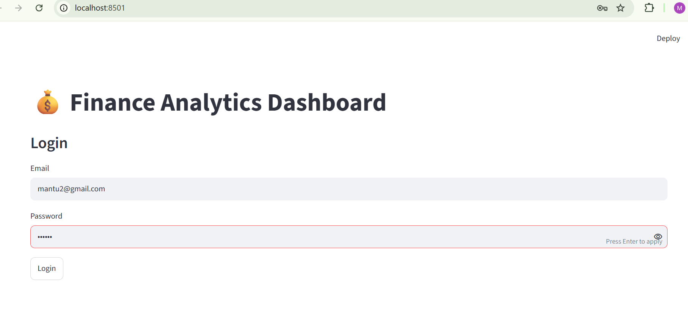
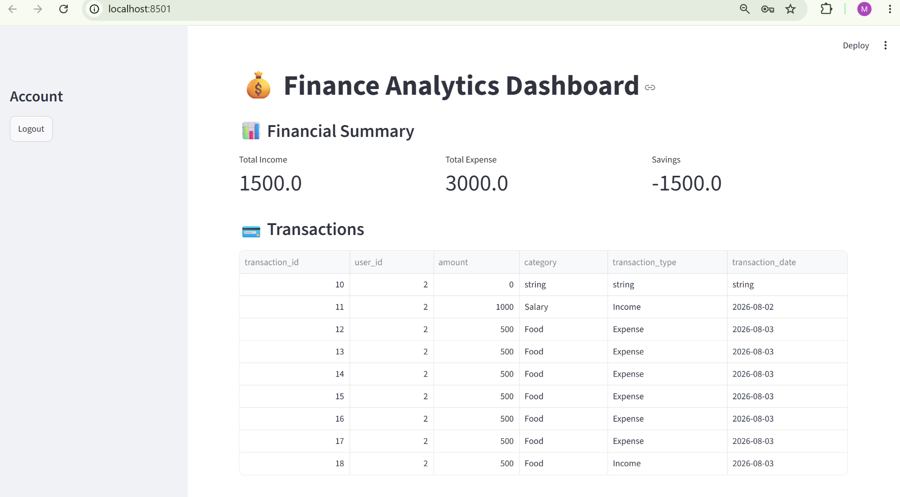
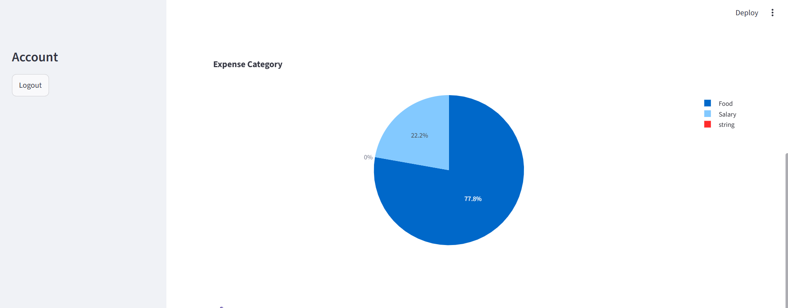
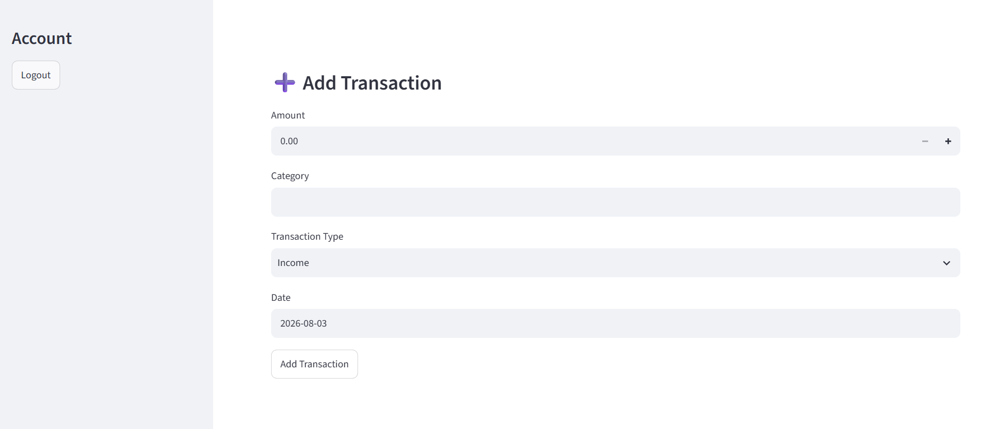

# Finance Analytics System

A Python financial management and analytics system that tracks income and expenses, exposes a JWT-secured REST API, analyses spending by category, and shows the results in an interactive Streamlit dashboard.

Built with **FastAPI**, **SQLite**, **Pandas**, **Matplotlib** and **Streamlit**.

## Screenshots

| Login | Dashboard |
|---|---|
|  |  |

| Expense Analysis | Add Transaction |
|---|---|
|  |  |

## Features

- User registration and login with JWT authentication
- Protected REST APIs to add, view and delete transactions
- Per-user income, expense and savings analytics
- Category-wise expense analysis and chart generation
- Interactive Streamlit dashboard
- Automated API tests with Pytest

## Tech Stack

| Category | Tools |
|---|---|
| Backend | Python, FastAPI, Pydantic, Uvicorn |
| Database | SQLite |
| Authentication | JWT, OAuth2 Password Flow, Passlib, Bcrypt |
| Data Analysis | Pandas, NumPy |
| Visualization | Matplotlib, Seaborn, Plotly |
| Dashboard | Streamlit |
| Testing | Pytest, FastAPI TestClient |

## Run Locally

```bash
git clone https://github.com/Mantu-231/Finance-Analytics-System.git
cd Finance-Analytics-System
python -m venv venv
venv\Scripts\activate          # macOS/Linux: source venv/bin/activate
pip install -r requirements.txt

uvicorn app.main:app --reload          # terminal 1
streamlit run dashboard/app.py         # terminal 2
```

- API docs (Swagger UI): `http://127.0.0.1:8000/docs`
- Dashboard: `http://localhost:8501`

Register a user in the dashboard (or at `/docs`), log in, and start adding transactions.

## Tests

```bash
pytest
```

## Future Improvements

- Monthly financial reports
- ML-based expense prediction
- Docker deployment and cloud hosting

## Author

**Mantu Kumar**, CSE student at GITAM University (Class of 2027)
[Portfolio](https://mantu-portfolio-eight.vercel.app) | [LinkedIn](https://www.linkedin.com/in/mantu-kumar-28311a308)
